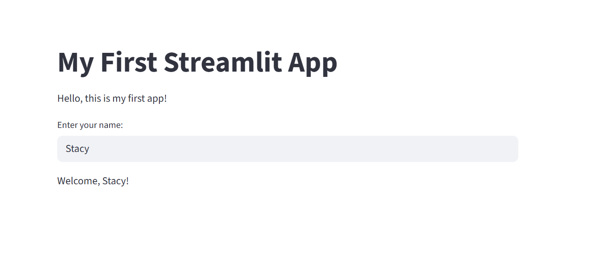
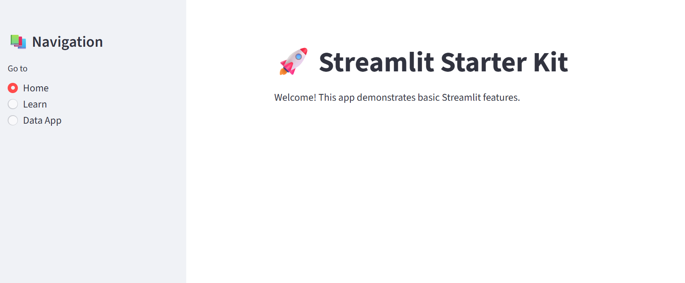
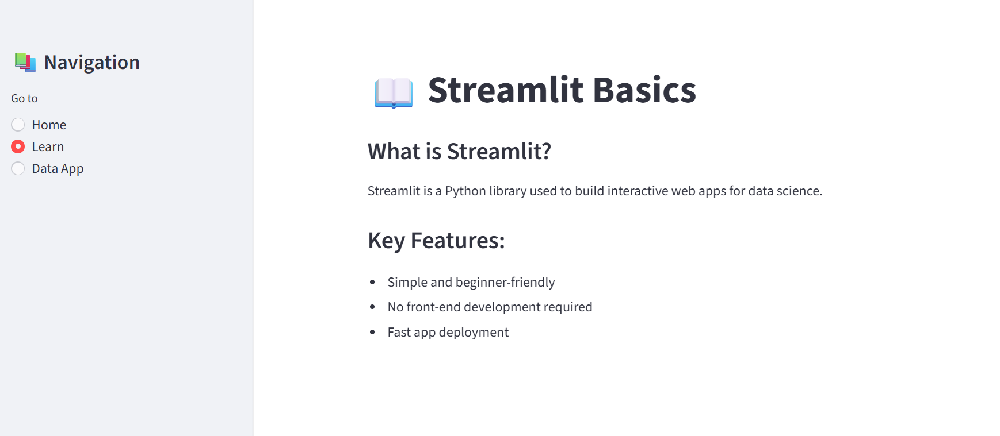
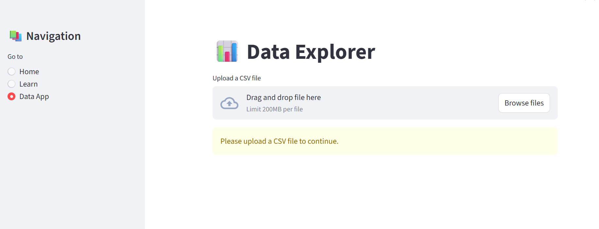
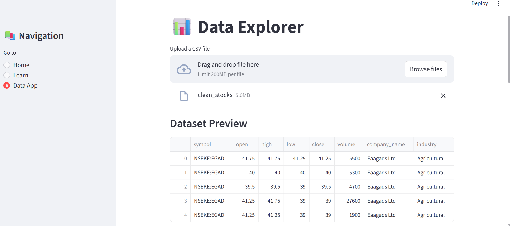
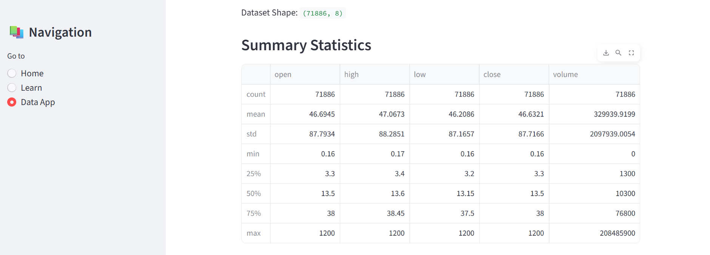
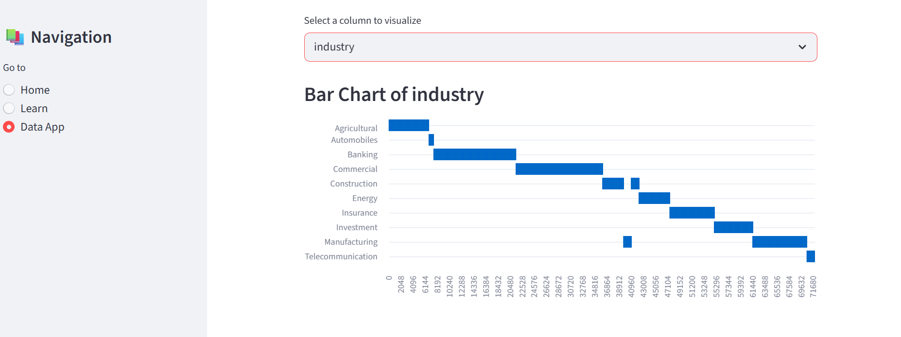

# 🧠 Getting Started with Streamlit for Data Science – A Beginner’s Guide

---

## 1. Title & Objective

### Technology Chosen
I chose **Streamlit**, a Python library used to build interactive web applications for data science and machine learning projects.

### Why I Chose It
I selected Streamlit because it allows me to transform data analysis into interactive applications without requiring front-end development skills. As an aspiring data scientist, this helps me present insights effectively and build portfolio-ready projects.

### End Goal
The goal of this project is to build a simple Streamlit application that:
- Allows users to upload a CSV dataset
- Displays the dataset
- Generates basic insights such as summary statistics

---

## 2. Quick Summary of the Technology

### What is Streamlit?
Streamlit is a Python library used to build interactive web applications for data science and machine learning projects. It allows users to create dashboards and data-driven apps without requiring knowledge of front-end technologies like HTML, CSS, or JavaScript.

### Where is it used?
- Data science dashboards  
- Machine learning model demos  
- Data exploration tools  

### Real-World Example
A data analyst can use Streamlit to build a dashboard that visualizes sales data and allows stakeholders to interact with filters and charts.

---

## 3. System Requirements

- **Operating System:** Windows / Mac / Linux  
- **Editor:** VS Code (recommended)  
- **Programming Language:** Python (3.7+)  
- **Packages Required:**
  - streamlit
  - pandas  

---

## 4. Installation & Setup Instructions
### Step 1: Install Dependencies
Install all required Python packages using the provided `requirements.txt` file:

```bash
pip install -r requirements.txt
```
This will install Streamlit, Pandas, and any other dependencies needed for the app.

### Step 2: Verify Installation
Check that Streamlit is installed and working correctly:
```bash
streamlit hello
```
This will launch a sample Streamlit app in your browser.
### Step 3: Create App File
Create a new Python file for your project:
```bash
touch app.py
```

### Step 4: Create my First App
Below is a simple “Hello World” Streamlit application. This app was created as part of my learning journey with AI:
```python
import streamlit as st

st.title("My First Streamlit App")

st.write("Hello, this is my first app!")

name = st.text_input("Enter your name:")

if name:
    st.write(f"Welcome, {name}!")
```
### Step 5: Run the App
```bash
streamlit run app.py
```
This will open the app in your browser.

### Explanation
This Streamlit app is a simple interactive demo that displays a title and a welcome message, lets the user enter their name, and then greets them personally. It demonstrates basic user interaction and how Streamlit handles text input and display.
- st.title() → Adds a title
- st.write() → Displays text/data
- st.text_input() → Takes user input

## First App Output



---

## 5. AI Prompt Journal
### Prompt 1
**Prompt Used:** "Explain Streamlit in simple terms for a beginner."

**AI Response Summary:** Streamlit is a Python tool for building data apps without front-end coding.

**Evaluation:** Very helpful for understanding the purpose of Streamlit quickly.
### Prompt 2
**Prompt Used:** "Give me a simple Streamlit hello world example."

**AI Response Summary:** Generated a basic app using st.title() and st.write().

**Evaluation:** Helped me create and run my first working app.
### Prompt 3
**Prompt Used:** "How do I upload a CSV file in Streamlit and display it?"

**AI Response Summary:** Introduced st.file_uploader() and pandas for reading files.

**Evaluation:** Very useful and directly applicable to my project.
### Prompt 4
**Prompt Used:** "How do I show summary statistics of a dataset in Streamlit?"

**AI Response Summary:** Suggested using df.describe().

**Evaluation:** Helpful in adding analytical functionality to the app.
### Prompt 5
**Prompt Used:** "Common beginner mistakes in Streamlit and how to fix them."

**AI Response Summary:** Highlighted installation errors and incorrect commands.

**Evaluation:** Useful for debugging and avoiding common issues.

## 6. Common Issues & Fixes
### Issue 1: Streamlit not installed
**Error:** 
```bash
ModuleNotFoundError: No module named 'streamlit'
```
**Explanation:** This happens when Streamlit is not installed in your current Python environment.

**Fix:** Install Streamlit using:
``` bash
pip install streamlit
```
### Issue 2: App not opening in browser
**Symptom:** Running streamlit run app.py doesn’t open the app or gives a connection error.

**Explanation:** Sometimes the browser doesn’t open automatically, or the command is run outside the correct folder/environment.

**Fix:** Make sure you are in the folder where app.py is located.
Ensure your Python environment has Streamlit installed

Run:
```bash
streamlit run app.py
```
If it still doesn’t open, copy the local URL shown in the terminal and paste it into your browser manually.

### Issue 3: CSV file not loading
**Symptom:** Uploaded CSV does not display or raises a FileNotFoundError / parsing error.

**Explanation:** The file may not have been uploaded correctly, or the file format is unsupported.

**Fix:** Make sure to use the file uploader in the app.
Ensure the CSV is properly formatted.

Read the file using pandas:
```bash
df = pd.read_csv(uploaded_file)
```
---

## 7. Understanding Streamlit's client-server architecture
Streamlit apps have a client-server structure. The Python backend of your app is the server. The frontend you view through a browser is the client. 

When you develop an app locally, your computer runs both the server and the client. If someone views your app across a local or global network, the server and client run on different machines. 
### Python backend (server)
When you execute the command `streamlit run your_app.py`, your computer uses Python to start up a Streamlit server. This server is the brains of your app and performs the computations for all users who view your app. 

Whether users view your app across a local network or the internet, the Streamlit server runs on the one machine where the app was initialized with streamlit run. The machine running your Streamlit server is also called a host.
### Browser frontend (client)
When someone views your app through a browser, their device is a Streamlit client. When you view your app from the same computer where you are running or developing your app, then server and client are coincidentally running on the same machine. 

However, when users view your app across a local network or the internet, the client runs on a different machine from the server.
### Server-client impact on app design
Keep in mind the following considerations when building your Streamlit app:

- The computer running or hosting your Streamlit app is responsible for providing the compute and storage necessary to run your app for all users and must be sized appropriately to handle concurrent users.

- Your app will not have access to a user's files, directories, or OS. Your app can only work with specific files a user has uploaded to your app through a widget like st.file_uploader.

- If your app communicates with any peripheral devices (like cameras), you must use Streamlit commands or custom components that will access those devices through the user's browser and correctly communicate between the client and server.

- If your app opens or uses any program or process outside of Python, they will run on the server. For example, you may want to use webrowser to open a browser for the user, but this will not work as expected when viewing your app over a network; it will open a browser on the Streamlit server, unseen by the user.

- If you use load balancing or replication in your deployment, some Streamlit features won't work without session affinity or stickiness. For more information, continue reading.

## 8. An Advanced App 
To deepen my understanding of Streamlit, I created an advanced interactive app that goes beyond a simple “Hello World.” This app allowed me to explore features like multi-page navigation, file uploads, data previews, summary statistics, and dynamic visualizations, giving me practical experience in building real-world data applications.  

Below is the output of what I created, shown through screenshots of the app in action.
### i. Home Page

 The Home page serves as an introduction to the app. It welcomes users and briefly explains the purpose of the project, demonstrating a clean and simple starting point for interacting with Streamlit.
### ii. Learn Page

The Learn page provides a concise overview of Streamlit, highlighting its key features such as simplicity, fast deployment, and no front-end development requirement. This helps users understand the technology behind the app. 
### iii. Data App Page

This page prompts users to upload a CSV file. It demonstrates the interactive component of the app and prepares users for exploring data within the application.
### iv. Dataset Preview

Once a CSV file is uploaded, the app displays the first few rows of the dataset. This allows users to quickly inspect the structure of the data, confirming that the upload was successful.
### v. Summary Statistics

After uploading, the app provides summary statistics and shows the shape of the dataset i.e. the number of rows and columns. This gives users an immediate understanding of the dataset’s size and basic characteristics.
### vi. Visualizations

Users can select a specific column, like Industry, to generate a bar chart. This demonstrates Streamlit’s interactive plotting capabilities and allows users to explore the data visually.

**What this advanced app does:**
This Streamlit app illustrates how to create a fully interactive, data-driven application with Python. From a simple home page introduction to dynamic data exploration and visualization, the app highlights the key strengths of Streamlit: easy-to-use interface, rapid deployment, and the ability to create multi-page applications with user interaction. By combining file uploads, data previews, statistical summaries, and visualizations, this project provides a practical example of how beginner-friendly tools can be leveraged for real-world data analysis.

---

## 9. References

- **Streamlit Official Documentation** – https://docs.streamlit.io  
- **Python Official Documentation** – https://docs.python.org/3/  
- **Pandas Documentation** - https://pandas.pydata.org
- **AI Tools Used:**  
  - ChatGPT (OpenAI) – assisted with learning Streamlit concepts and code explanations  
  - Claude (Anthropic) – provided guidance on project structure and workflow  
  - Gemini Pro (Google DeepMind) – helped generate code examples and troubleshooting tips  